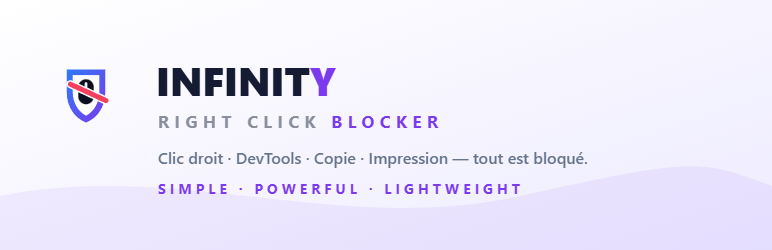
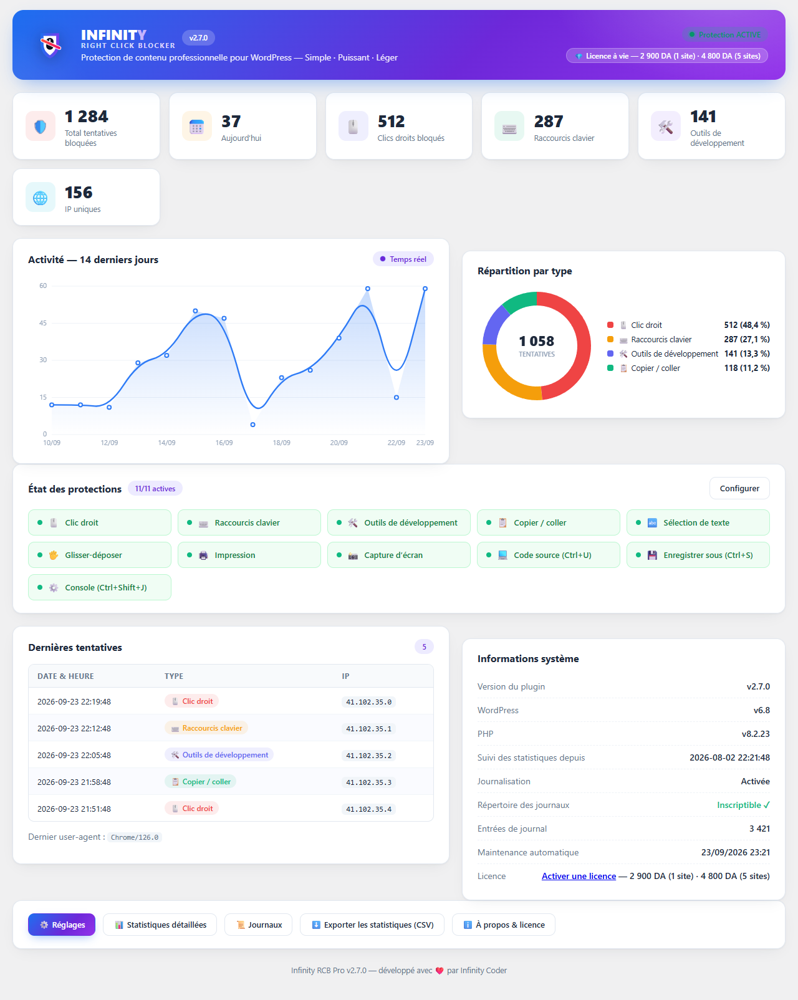
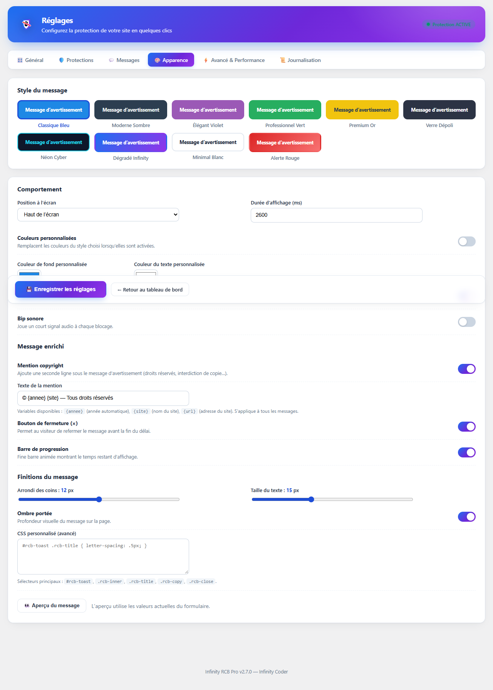
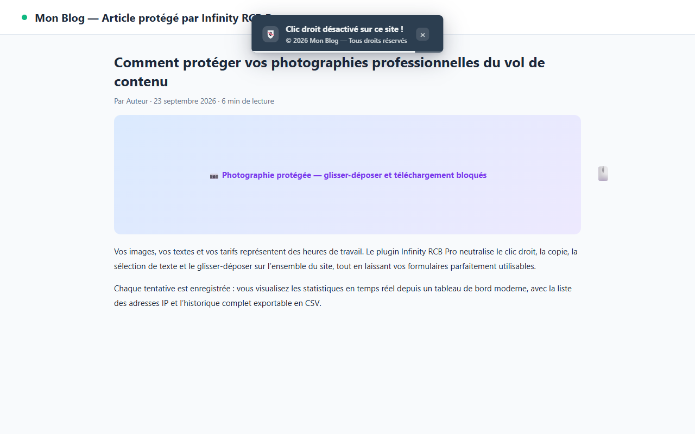
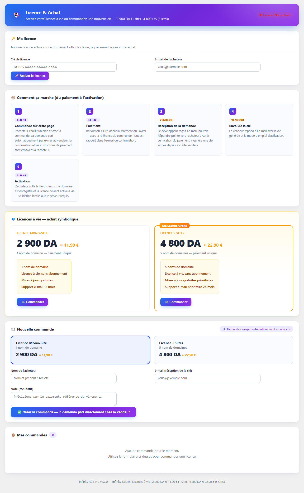
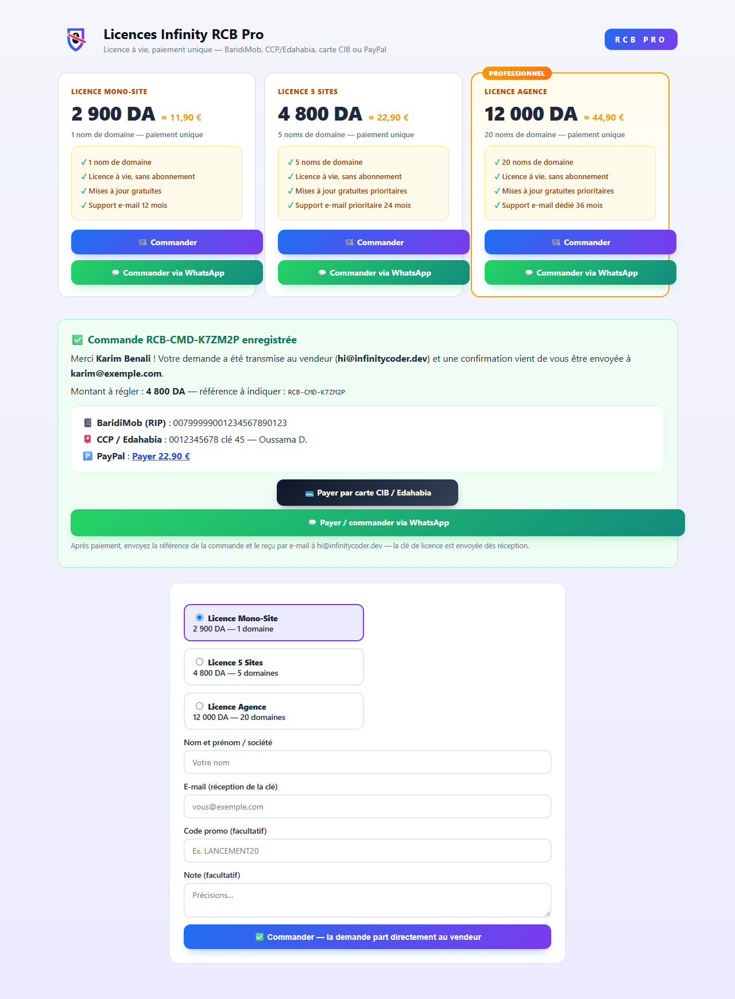
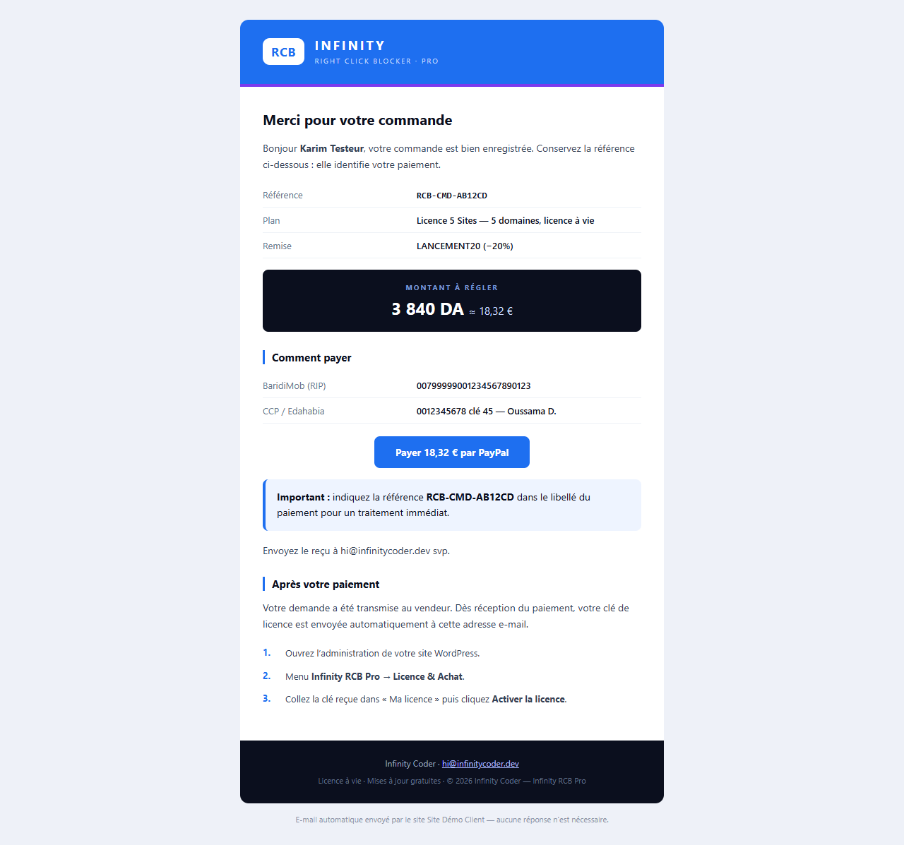

<div align="center">



# 🛡️ Right Click Blocker PRO

**Protection de contenu professionnelle pour WordPress** — clic droit, copie, sélection, glisser-déposer, impression, captures d'écran et outils de développement, avec messages personnalisés, statistiques temps réel et journaux.

**Tout est inclus, gratuitement. Aucune fonctionnalité verrouillée.**

[](https://github.com/derouicheoussama/right-click-blocker-pro/releases/latest)
[](LICENSE.md)
[](https://wordpress.org/)
[](https://www.php.net/)
[](https://github.com/derouicheoussama/right-click-blocker-pro/commits/main)

[✨ Fonctionnalités](#-fonctionnalités) · [📸 Captures](#-captures) · [📥 Installation](#-installation) · [🔄 Mises à jour](#-mises-à-jour) · [🔒 Sécurité](#-sécurité) · [🤝 Contribuer](#-contribuer)

</div>

---

> ### ✅ Conformité WordPress.org
> Ce plugin respecte les directives du répertoire officiel : **guides 5 & 6 (pas de trialware)** — chaque fonctionnalité est gratuite et pleinement fonctionnelle sans aucune clé de licence. Les licences à vie mentionnées ci-dessous sont **symboliques et optionnelles** : elles financent le support, ne verrouillent rien et n'activent rien. Le canal de mise à jour GitHub de ce dépôt est **exclu du build WordPress.org** et se désactive automatiquement dès que le répertoire officiel gère l'extension.
>
> **Édition duale** : la version **WordPress.org** est l'édition complète et 100 % gratuite. La version distribuée ici (canal vendeur) ajoute un **module Pro** — options cosmétiques avancées débloquées par la licence à vie : **logo personnalisé du message, filigrane d'images réglable, CSS personnalisé** (+ support prioritaire et alertes e-mail). Les 16 protections restent intégralement libres dans les deux éditions.

## ✨ Fonctionnalités

### 16 protections actives

| Protection | Incluse |
|---|---|
| 🖱️ Clic droit bloqué (menu contextuel) | ✅ |
| ⌨️ Raccourcis clavier (F12, Ctrl+U/S/P, Ctrl+Shift+I/J/C/K) | ✅ |
| 📋 Anti copier-coller (champs de saisie préservés) | ✅ |
| 🔤 Anti sélection de texte | ✅ |
| 🖐️ Anti glisser-déposer (images, liens) | ✅ |
| 🖨️ Anti impression (avertissement à la place du contenu) | ✅ |
| 📸 Anti capture d'écran (PrintScreen + presse-papiers vidé) | ✅ |
| 🛠️ Détection des outils de développement (flou / redirection) | ✅ |
| 💧 Filigrane d'images (texte, opacité et taille réglables) | ✅ * 🔓 |
| 🖼️ Anti-clickjacking (X-Frame-Options + frame busting) | ✅ |
| 📱 Protection tactile iOS/Android (long-press) | ✅ |
| 🍯 Antispam commentaires — honeypot | ✅ |
| ⏱️ Antispam — délai minimal de saisie | ✅ |
| 🚦 Antispam — limite de débit par IP | ✅ |
| 🚫 Antispam — liste noire de mots-clés | ✅ |
| 🔗 Antispam — plafond de liens par commentaire | ✅ |

*\* 🔓 : libre dans l'édition WordPress.org · option Pro (licence à vie) dans le canal vendeur de ce dépôt.*

### Le confort en plus

- 🎨 **Message d'avertissement personnalisable** : 10 styles, couleurs libres, copyright automatique `{annee} {site}`, bouton de fermeture, barre de progression, bip sonore — taille et arrondi au pixel
- 🔓 **Options Pro (licence, canal vendeur uniquement)** : logo personnalisé PNG/SVG à la place du bouclier · filigrane d'images réglable (texte, opacité, taille) · CSS personnalisé du message
- 👀 **Aperçu en temps réel** : le message se comporte comme chez le visiteur (apparition → durée → disparition), chaque réglage s'y reflète instantanément
- 📊 **Tableau de bord temps réel** : KPI animés, graphiques 14/30 jours, répartition par type, IP uniques, widget d'accueil WordPress
- 📜 **Journaux détaillés** filtrables et exportables CSV, rétention automatique
- 🚨 **Alerte e-mail** en cas de pic de tentatives
- 🛒 **Parcours d'achat guidé** (site vendeur) : commande → BaridiMob / CCP / carte CIB-Edahabia / PayPal → « J'ai payé » → **clé livrée automatiquement par e-mail**, avec modale de paiement détaillée
- 🔑 **Licences à vie signées ECDSA P-256** (Mono-Site 2 900 DA · 5 Sites 4 800 DA · Agence 12 000 DA) — *optionnelles, symboliques, aucune fonction verrouillée*
- 💾 Import/export JSON des réglages, exclusions pages/admin/rôles, multisite

## 📸 Captures

| Tableau de bord | Personnalisation temps réel | Message visiteur |
|---|---|---|
|  |  |  |

| Licence & Achat | Boutique publique | E-mails HTML |
|---|---|---|
|  |  |  |

## 📥 Installation

### Depuis WordPress.org *(recommandé)*
**Extensions → Ajouter** → recherchez « Right Click Blocker PRO » → **Installer** → **Activer**.

### Depuis une release GitHub *(installation manuelle)*
1. Téléchargez `right-click-blocker-pro.zip` sur la [dernière release](https://github.com/derouicheoussama/right-click-blocker-pro/releases/latest)
2. **Extensions → Ajouter → Téléverser** → le `.zip` → **Activer**
3. Les mises à jour arriveront automatiquement depuis GitHub (voir ci-dessous)

### Depuis les sources
```bash
git clone https://github.com/derouicheoussama/right-click-blocker-pro.git
cd right-click-blocker-pro
# zip du dossier = plugin prêt à téléverser (updater inclus)
```

## 🔄 Mises à jour

**Double canal, sans conflit :**
- **WordPress.org** — automatique et prioritaire dès que l'extension y est publiée (ou en provient) ;
- **GitHub** — pour les installations manuelles : consultation des releases toutes les 12 h, ou bouton **« Vérifier maintenant »** (Réglages → Général). Une **carte dédiée** apparaît alors sur la page *Mises à jour* de WordPress (version, canal, notes, mise à jour en 1 clic). Ce canal **se désactive tout seul** dès que wp.org gère l'extension ;
- Dépôt personnalisé : `define( 'INFINITY_RCB_GITHUB_REPO', 'utilisateur/depot' );` dans `wp-config.php`.

### Publier une version (développeur)

```bash
# 1. Mettre à jour la version : en-tête de infinity-rcb-pro.php,
#    la constante INFINITY_RCB_VERSION et le « Stable tag » de readme.txt
# 2. Committer, taguer, pousser :
git tag vX.Y.Z && git push origin main vX.Y.Z
# 3. GitHub Actions construit right-click-blocker-pro.zip
#    + rcb-manifest.json (SHA-256 par fichier) + SHA256SUMS.txt
```

## 🔒 Sécurité

- **Licences infalsifiables** : clés signées **ECDSA P-256** — la clé privée ne quitte jamais le serveur du vendeur
- **Manifeste d'intégrité** `rcb-manifest.json` dans chaque build → *À propos → 🔒 Intégrité* détecte toute copie altérée avant redistribution
- **Zip vérifiable** : chaque release joint `SHA256SUMS.txt`
- **Webhook paiement signé** (HMAC-SHA256, comparaison en temps constant)
- Nonces, capacités, échappement, `ABSPATH` sur tous les points d'entrée — **aucune donnée sortante, aucun cookie**

Signalement de vulnérabilité : [SECURITY.md](SECURITY.md) — divulgation responsable par e-mail, jamais en issue public.

## 🤝 Contribuer

Les contributions sont bienvenues ! Consultez [CONTRIBUTING.md](CONTRIBUTING.md) :

- 🐛 **Bug** → ouvrez une [issue](https://github.com/derouicheoussama/right-click-blocker-pro/issues/new?template=bug_report.md) avec le modèle fourni
- 💡 **Idée** → [issue d'amélioration](https://github.com/derouicheoussama/right-click-blocker-pro/issues/new?template=feature_request.md)
- 🔧 **Code** → branche `feature/…`, standards [WordPress Coding Standards](https://developer.wordpress.org/coding-standards/), `php -l` avant tout commit

## ⚖️ Licence

Copyright © 2026 **Infinity Coder** — [hi@infinitycoder.dev](mailto:hi@infinitycoder.dev)

**GPL v2 ou ultérieure** — voir [LICENSE.md](LICENSE.md).

> 💠 Licence de support à vie optionnelle (à partir de 2 900 DA ≈ 11,90 €) : elle finance le développement et offre un support prioritaire — **toutes les fonctionnalités restent gratuites et complètes sans licence**.
